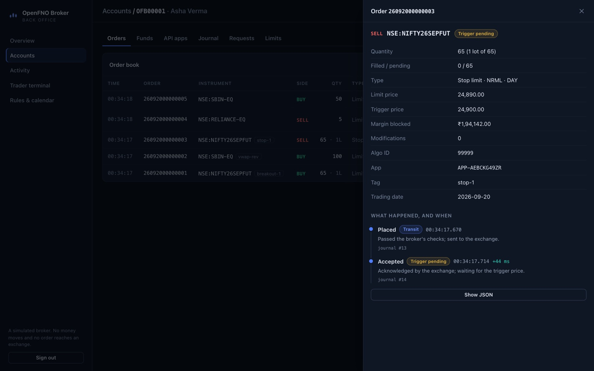
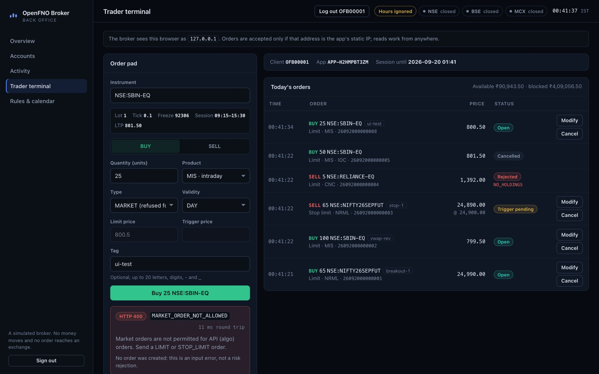

# OpenFNO Broker

A simulated Indian stock broker. Trading engines connect to it to meet the
rules they will meet at a real broker, before real money is at stake.

It enforces the SEBI retail-algo framework, in force for every broker since
1 April 2026: static-IP whitelisting, a daily two-factor login, 10 order
operations per second, no market orders, and an algo tag on every order. It
also enforces each exchange's lot sizes, tick sizes, freeze quantities,
trading hours and holidays, and a broker's risk checks: margin, holdings,
price bands and the intraday cut-off. Every order, refusal and login is
recorded in an append-only journal. Every API call is logged with the
milliseconds it spent at each step.

It is part of [OpenFNO](https://openfno.com), an open-source algo-trading desk
for Indian F&O. The trading engine there will place its orders here first.

> **Not a real broker.** No money moves and nothing reaches an exchange. The
> rules are taken from public circulars and broker documentation (see
> [docs/rules.md](docs/rules.md)); where a value is our assumption, the docs
> say so. Not affiliated with SEBI, NSE, BSE, MCX, FYERS or Dhan.

## Why

Paper trading usually fills an order the moment the strategy decides to
trade. A real broker first checks the session, the caller's IP, the rate, the
lot, the tick, the margin and the market hours. Then the exchange takes a few
milliseconds to acknowledge the order, and during that time the order cannot
be changed. An engine that has only met the first world meets the second with
real money. This service is the second world, without the money.

## What it does today

| | |
|---|---|
| **Accounts** | Client IDs, pay-ins and pay-outs with a ledger, API apps with whitelisted static IPs (one change per calendar week) |
| **Login** | App credentials plus a TOTP code, once a day; sessions end at 06:00 IST; a code works once |
| **Orders** | Place, modify and cancel for LIMIT and STOP_LIMIT orders on NSE, BSE and MCX cash, F&O and commodities; DAY and IOC validity; tags; the exchange's acknowledgement after a configurable latency; day orders expire at the session close |
| **Checks** | Instrument, market hours and holidays, whole lots, freeze quantity, tick size, stop-trigger geometry, product by segment, market-order and commodity-IOC bans, margin, holdings, price band, intraday cut-off, rate limits |
| **Fills** | A pessimistic matching engine driven by the live quote: an arriving order pays the opposite side's price, a resting order fills when the market trades through it, stops trigger on the last trade, IOC leftovers are cancelled, and nothing fills on a stale quote |
| **After the fill** | Tradebook, positions netted by symbol and product, holdings, realised and unrealised P&L, and charges per trade: brokerage, STT or CTT, exchange and SEBI fees, stamp duty and GST, at the rates in force on the trading day |
| **RMS** | Intraday square-off at 15:20 (23:25 on MCX) with the broker's fee, and a kill switch that cancels every order, optionally closes every position, and cannot be lifted by the client until the next day |
| **End of day** | Day orders expire, intraday positions close, expired contracts settle, futures mark to market, delivery moves into holdings, and the day's profit and charges are posted to the ledger |
| **Live events** | A WebSocket per account, and one for the back office: every order, trade, funds and kill-switch event the moment it is recorded |
| **Sandbox** | An offline market that walks prices with a bid, an ask and depth, plus injected faults — slow acknowledgements, exchange rejections, lost responses (504), outages (503), a stopped feed — and an "end the day now" button |
| **Records** | The journal (every event, gap-free, replayed on start), order histories with a timestamp per step, contract notes, and a request log with auth, rate-limit, queue, decision and journal time per call |
| **Market** | 1,27,000+ instruments from the FYERS and Dhan public masters; live prices from the OpenFNO platform's Redis tick stream |
| **Web console** | A back office in the browser: market and feed status, today's totals and latencies, accounts with TOTP onboarding, every order's timeline, positions, trades, holdings, contract notes, the journal, each call's latency split, a sandbox, and a trader terminal that places orders through the public API and watches them fill live |





## Run it

You need the .NET 10 SDK and Node 24.

```sh
scripts/fetch-instruments.sh          # ~60 MB of public instrument masters into data/instruments
(cd web && npm ci && npm run build)   # the console, built into the API's wwwroot
cd src/OpenFno.Broker.Api
Exchange__AlwaysOpen=true dotnet run  # http://localhost:5310, in-memory, admin key "dev-admin-key"
```

Open http://localhost:5310 and sign in with the admin key. The walk-through:

1. Open an account and scan its TOTP QR code into an authenticator app.
2. Pay in some funds.
3. Issue an API app for `127.0.0.1`.
4. Log in on the Trader terminal page and place orders.

While working on the console, `npm run dev` in `web/` serves it on :5320 with
hot reload, against the broker on :5310.

`Exchange__AlwaysOpen=true` ignores trading hours, so you can try it at night
or at a weekend. Leave it off to get real market hours.

With Postgres, so that state survives restarts:

```sh
BROKER_ADMIN_KEY=choose-a-long-random-key docker compose up --build
```

On a machine that also runs an OpenFNO platform, add the second compose file
so the broker prices its instruments from the platform's live tick stream:

```sh
BROKER_ADMIN_KEY=… BROKER_REDIS=algotrading_redis:6379 \
  docker compose -f docker-compose.yml -f docker-compose.platform.yml up -d --build
```

Then follow [docs/api.md](docs/api.md) for a full session from start to
finish: open an account, log in with TOTP, place, modify and cancel orders,
and read the journal.

## How it is built

A single writer applies commands one at a time. Each command's events are
written to the journal before the in-memory state changes. A restart replays
the journal into the same state. The design is in
[docs/architecture.md](docs/architecture.md), and the reasons for its main
choices are in [docs/decisions](docs/decisions).

```
src/
  OpenFno.Broker.Domain          rules, order state machine, margin, rate limiter, TOTP, events — no I/O
  OpenFno.Broker.Application     the engine, its state and ports
  OpenFno.Broker.Infrastructure  Postgres journal, Redis feed, instrument masters, calendar
  OpenFno.Broker.Api             HTTP, filters, request tracing; serves the console
web/                             the back-office console (React, TypeScript, Vite)
tests/                           unit, engine, replay and HTTP tests
data/calendar                    exchange holidays and special sessions, with their circulars
data/reference                   commodity lot sizes
```

## Tests

```sh
dotnet test
(cd web && npm test)
```

The Postgres tests run when `BROKER_TEST_POSTGRES` points at a throwaway
database. CI starts one.

## Roadmap

Matching, charges, positions, RMS and settlement are done. Next:

1. **The OpenFNO engine as a client.** A broker adapter in the platform, with
   an execution layer that works out an order's fate from the order book
   after a timeout, as it must with a real broker.
2. **Real margins.** SPAN plus exposure from the exchanges' risk-parameter
   files, in place of the flat percentages the profile uses now.
3. **The rest of the order book.** Slicing above the freeze quantity, cover
   and bracket orders, GTT, and physical settlement of stock derivatives.

## License

[PolyForm Noncommercial 1.0.0](LICENSE). Free to use, study and change for
any noncommercial purpose.
